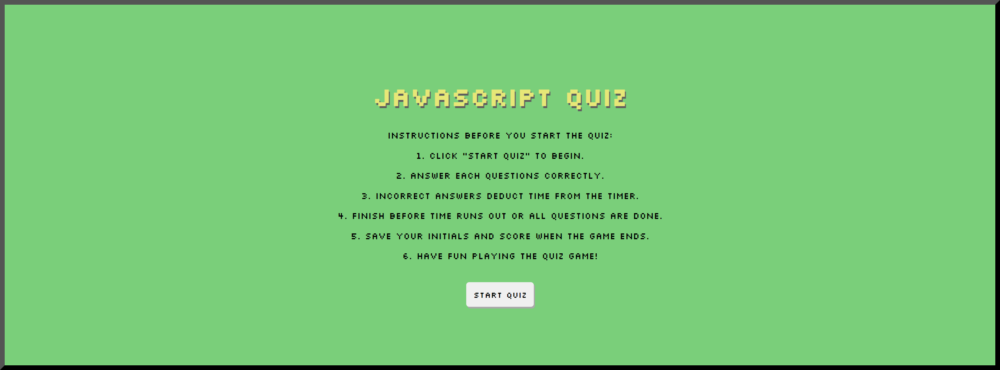
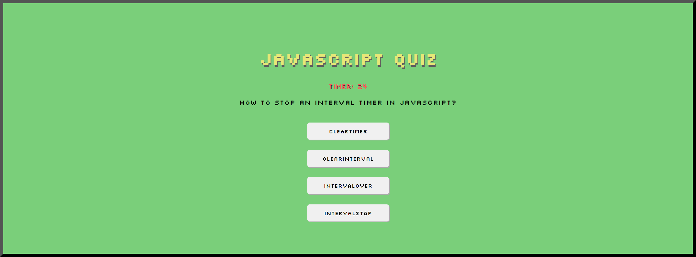

# Javascript Quiz

## Description

This project is a JavaScript Quiz that challenges users on their knowledge of JavaScript fundamentals. The quiz is timed, and users need to answer a series of multiple-choice questions. After completing the quiz, users can save their initials and score to compare their performance with others.

The motivation behind this project is to create an interactive and engaging way for users to test their knowledge of JavaScript. It provides an opportunity for self-assessment and allows users to track their progress over time.

### Problem Solving

This quiz app solves the problem of assessing a user's understanding of JavaScript concepts in a timed and challenging environment. It also offers a feature to save and display high scores, fostering friendly competition among users.

### Learning

While working on this project, I gained practical experience in building a responsive and interactive web application using HTML, CSS, and JavaScript. I learned how to manipulate the DOM, handle user input, and manage timers.

## Installation

To install and run this project locally, follow these steps:

1. Clone the repository to your local machine.
    
    git clone git@github.com:jodielee062788/js-code-quiz.git

2. Open the project folder in your code editor.
3. Explore the code and open index.html in your web browser.

## Usage

1. Click the "Start Quiz" button to begin the quiz.

    

2. Answer each question by clicking on the provided multiple-choice options.

    

3. Correct answers increase your score, while incorrect answers deduct time. Finish before the timer runs out or when all questions are answered.

    

4. Save your initials and score when the game ends.

    

5. Explore the leaderboard to see high scores.

    

## Live Demo

Check out the live demo of the Password Generator [here](https://jodielee062788.github.io/js-code-quiz/).

## Credits

- This project was created by Jodie Lee 
- Questions and answers are from [Interviewbit.com](https://www.interviewbit.com/javascript-mcq/)
- USYD Bootcamp

## How to Contribute

If you'd like to contribute to this project, please follow these guidelines:

1. Fork the project.
2. Create a new branch for your feature or bug fix.
3. Commit your changes.
4. Submit a pull request.

